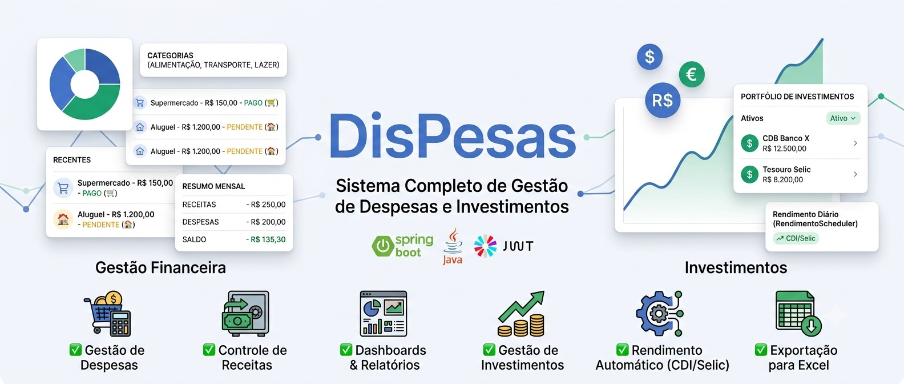
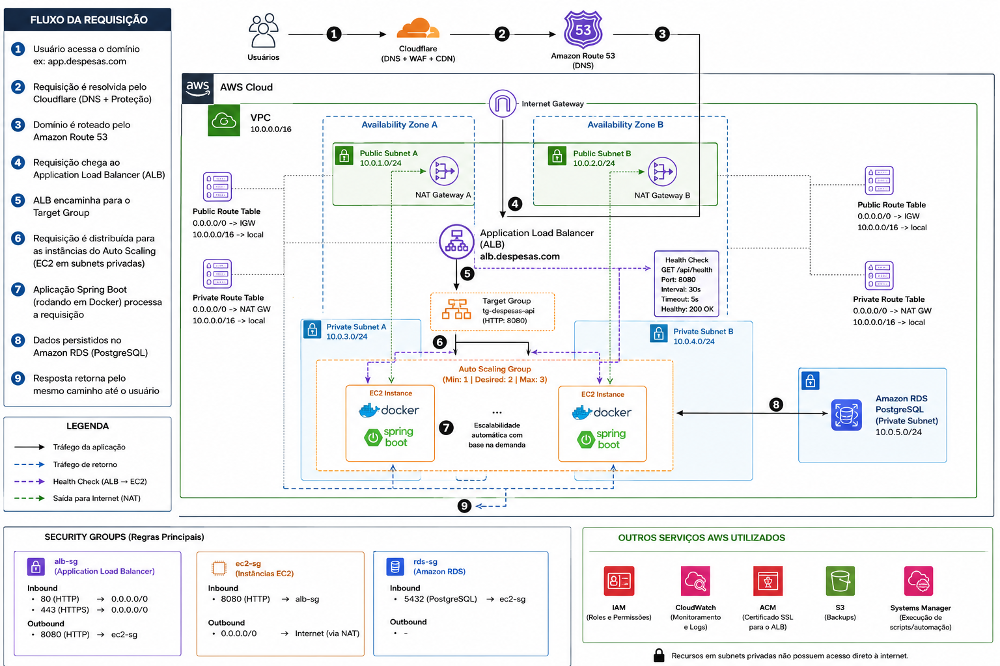
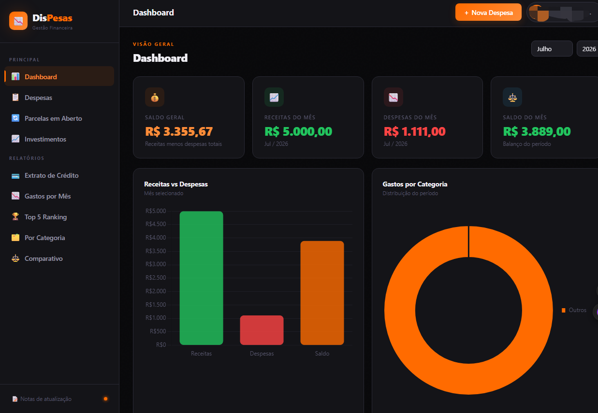
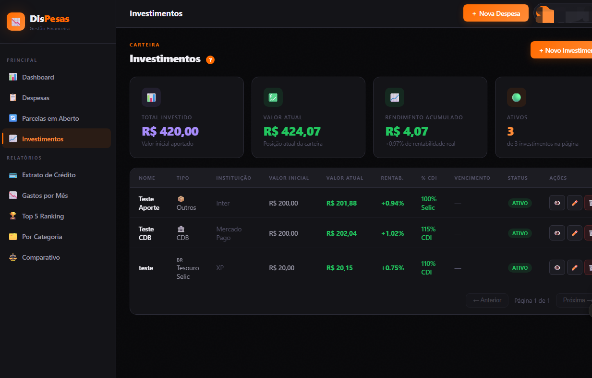

# Expense Manager API

> API REST desenvolvida com Java e Spring Boot para gerenciamento completo de despesas pessoais, investimentos e indicadores financeiros.

<p align="center">


</p>

<p align="center">


Java 21
Spring Boot
Spring Security
JWT
Docker
PostgreSQL
AWS
GitHub Actions

</p>

---

# Sobre o projeto

A Expense Manager API nasceu com um objetivo simples: resolver um problema real.

Durante algum tempo senti falta de uma aplicação que permitisse controlar despesas de maneira simples, organizada e com indicadores úteis para tomada de decisão.

Ao invés de utilizar uma solução pronta, decidi desenvolver toda a plataforma do zero, desde o backend até a infraestrutura.

Hoje o sistema está em produção sendo utilizado por usuários reais.

Além do ambiente de produção em VPS, toda a infraestrutura foi projetada e validada na AWS utilizando uma arquitetura voltada para alta disponibilidade, escalabilidade e segurança.

---

# Demonstração


---

# Principais funcionalidades

✔ Cadastro de usuários

✔ Autenticação JWT

✔ Controle de permissões

✔ CRUD completo de despesas

✔ Gestão de investimentos

✔ Dashboard financeiro

✔ Comparativo entre meses

✔ Extrato financeiro

✔ Upload de comprovantes

✔ Exportação para Excel

✔ Scheduler para cálculo automático de investimentos

✔ Filtros dinâmicos (Specification)

✔ Autocomplete

✔ Paginação

✔ Health Check

✔ API REST

---

# Arquitetura da aplicação


```
Frontend

↓

Spring Boot

↓

Service

↓

Repository

↓

PostgreSQL
```

---

# Arquitetura AWS

A aplicação foi implantada em uma arquitetura AWS voltada para alta disponibilidade e segurança.


A infraestrutura é composta por:

- Amazon Route53
- VPC
- Public Subnets
- Private Subnets
- Internet Gateway
- NAT Gateway
- Route Tables
- Application Load Balancer
- Auto Scaling Group
- Launch Template
- EC2
- Docker
- Amazon RDS PostgreSQL
- Security Groups
- Health Checks

Fluxo da requisição

Usuário

↓

Cloudflare

↓

Amazon Route53

↓

Application Load Balancer

↓

Target Group

↓

EC2

↓

Spring Boot

↓

PostgreSQL

---

# Segurança

O projeto foi desenvolvido seguindo boas práticas de segurança.

- JWT Authentication

- Spring Security

- Senhas criptografadas com BCrypt

- Banco de dados isolado em subnet privada

- Comunicação entre serviços utilizando Security Groups

- Health Checks para monitoramento

---

# Tecnologias

Backend

- Java 21

- Spring Boot

- Spring Security

- Spring Data JPA

- Hibernate

- Maven

Banco

- PostgreSQL

Infraestrutura

- Docker

- Docker Compose

- Nginx

- AWS

Cloud

- EC2

- Auto Scaling

- ALB

- Route53

- VPC

- RDS

---

# Estrutura do projeto

```

src
├── config
├── controller
├── dto
├── entity
├── enums
├── exception
├── mapper
├── repository
├── scheduler
├── security
├── service
├── specification
└── util

```

---

# Como executar

Clone

```

git clone ...

```

Entre

```

cd expense-api

```

Configure

```

application.properties

```

Execute

```

mvn clean install

```

Depois

```

mvn spring-boot:run

```

---

# Docker

Build

```

docker build -t expense-api .

```

Executar

```

docker run ...

```

---

# Endpoints

| Método | Endpoint | Descrição |
|---------|----------|-----------|
| POST | /auth/login | Login |
| GET | /despesas | Lista despesas |
| POST | /despesas | Nova despesa |
| PUT | /despesas/{id} | Atualiza |
| DELETE | /despesas/{id} | Remove |

...

---

# Health Check

```

GET

/api/health

```

Resposta

```

200 OK

{
"status":"UP"
}

```

---

# Roadmap

- [x] CRUD

- [x] JWT

- [x] Dashboard

- [x] Upload

- [x] Exportação Excel

- [x] Docker

- [x] AWS

- [ ] Terraform

- [ ] ECS

- [ ] Redis

- [ ] Prometheus

- [ ] Grafana

---

# Screenshots

Dashboard




Investimentos




---

# Autor

Ryan Moscardini

LinkedIn https://www.linkedin.com/in/ryan-moscardini/

GitHub https://github.com/ryanmosc

---

Se este projeto foi útil para você, deixe uma ⭐ no repositório.